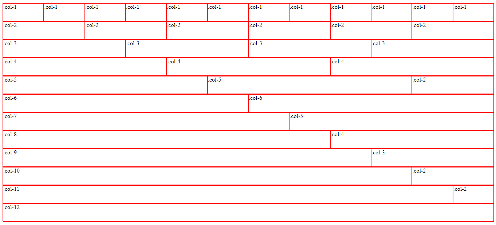

# CSS Framework

This is a project that I completed as a part of [Parsity's](parsity.io) coding bootcamp curriculum.

The purpose of this project was to build a custom CSS framework in order to better understand how common frameworks (such as [Bootstrap](https://getbootstrap.com/)) work under the hood. The framework provides you with 12 columns of various sizes that are ready to use for structuring a website.



## How to Use

To use this framework in your project, download the framework.css file and add it to your project's directory. At the top of your html head section, add `<link rel="stylesheet" href="framework.css" />`. When you want to add a column, do so like this:

```jsx
<div class="row">
  <div class="col-1"></div>
</div>
```

The columns are identified by classes (`col-1` through `col-12`, in which `col-1` is the smallest column at 8.33% the width of the window, and `col-12` is the largest at 100%).
